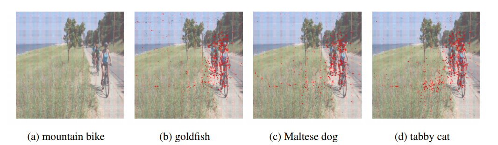

## Getting Started
Recent studies show that widely used Deep neural networks (DNNs) are vulnerable to the carefully crafted adversarial examples.
Many advanced algorithms have been proposed to generate adversarial examples by leveraging the L_p distance for penalizing perturbations.
Different defense methods have also been explored to defend against such adversarial attacks. 
While the effectiveness of L_p distance as a metric of perceptual quality remains an active research area, in this paper we will instead focus on a different type of perturbation, namely spatial transformation, as opposed to manipulating the pixel values directly as in prior works.
Perturbations generated through spatial transformation could result in large L_p distance measures, but our extensive experiments show that such spatially transformed adversarial examples are perceptually realistic and more difficult to defend against with existing defense systems. This potentially provides a new direction in adversarial example generation and the design of corresponding defenses.
We visualize the spatial transformation based perturbation for different examples and show that our technique
can produce realistic adversarial examples with smooth image deformation.
Finally, we visualize the attention of deep networks with different types of adversarial examples to better understand how these examples are interpreted.

### Requirment
```
pytorch>=1.2.1
scipy
```

### Dowload dataset
Note that it might take a while to download/perform attack on the whole ImageNet dataset. It's recommended only use a small subset of it to conduct the experiment.

```bash
sh data/dowload_data.sh
```

## Generate Adversarial Examples:
```bash
python stAdv.py --save_path <path-to-save-log> --ld_tv <coeff-total-variation> --ld_adv <coeff-adversarial>
```
Example:
```
python stAdv.py --save_path debug --ld_tv 50 --ld_adv 0.05
```
## Results


## License
MIT License
